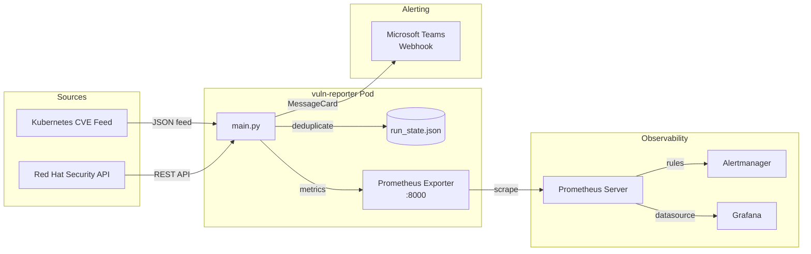

# Vuln-Reporter

A lightweight Python-based vulnerability monitoring tool that continuously fetches CVEs from the **Kubernetes** and **Red Hat (OpenShift)** security feeds, deduplicates them, and delivers real-time alerts to **Microsoft Teams** — with built-in **Prometheus metrics** and **Grafana** integration for observability.

> **Production usage:** Currently deployed and actively used by multiple **banking** and **healthcare** organizations running OpenShift and Kubernetes clusters.

---

## Architecture



---

## Features

- **Dual-source CVE monitoring** — Fetches from the official Kubernetes CVE feed and Red Hat Security Data API on a 5-minute cycle.
- **Deduplication with persistence** — Tracks processed CVE IDs in `run_state.json` to avoid duplicate alerts, even across pod restarts.
- **Teams alerting** — Sends color-coded MessageCards to Microsoft Teams with severity, CVSS score, description, and direct links.
- **Prometheus metrics** — Exposes `cve_critical_total` gauge (labeled by source) for integration with alerting rules.
- **Prometheus + Grafana stack** — Includes Helm values and a one-command deployment script with auto-configured datasource.
- **Minimal footprint** — Runs on `python:3.11-alpine` with a non-root user, optimized for security-conscious environments.

---

## Quick Start

### Prerequisites

- A running Kubernetes cluster (Minikube, OpenShift, etc.)
- `kubectl` configured against your cluster
- A Microsoft Teams Incoming Webhook URL

### 1. Configure the webhook secret

Edit `teams-webhook-secret.yaml` and replace the placeholder with your actual Teams webhook URL:

```yaml
stringData:
  TEAMS_WEBHOOK: "https://your-org.webhook.office.com/..."
```

### 2. Deploy everything

Run the deployment script, which builds the image, deploys the app, and sets up the full Prometheus + Grafana stack:

```bash
chmod +x despliegue.sh
./despliegue.sh
```

This will:

1. Build the Docker image via Minikube
2. Apply the secret and deployment manifests
3. Install Prometheus and Grafana via Helm
4. Configure the Grafana datasource automatically
5. Expose Prometheus on `localhost:9090` and Grafana on `localhost:3000`

### Manual deployment (step by step)

```bash
# Build image
minikube image build -t vuln_reporter:1.0 .

# Deploy secret and app
kubectl apply -f teams-webhook-secret.yaml
kubectl apply -f deployment.yaml

# Deploy Prometheus with custom values
helm upgrade --install prometheus prometheus-community/prometheus \
  -n monitoring --create-namespace -f values.yaml

# Deploy Grafana
helm upgrade --install grafana grafana/grafana -n monitoring

# Get Grafana password
kubectl get secret -n monitoring grafana \
  -o jsonpath="{.data.admin-password}" | base64 --decode; echo
```

---

## How It Works

The main loop runs every **5 minutes** and performs the following cycle:

1. **Load state** — Reads `run_state.json` to recover the last check timestamp and the set of already-processed CVE IDs.
2. **Fetch CVEs** — Queries both the Kubernetes and Red Hat feeds for the most recent vulnerabilities.
3. **Deduplicate** — Skips any CVE whose ID is already in the processed set.
4. **Alert** — Sends a Teams MessageCard for each new CVE, color-coded by CVSS severity (Critical ≥ 9.0, High ≥ 7.0, Medium ≥ 4.0, Low > 0).
5. **Expose metrics** — Updates the `cve_critical_total` Prometheus gauge per source.
6. **Persist state** — Writes the updated timestamp and processed IDs back to `run_state.json`.

### Prometheus Alerting

The included `values.yaml` defines an alert rule that fires when critical vulnerabilities (CVSS ≥ 9.0) are detected:

```yaml
- alert: CriticalCVEDetected
  expr: cve_critical_total > 0
  for: 1m
  labels:
    severity: critical
```

---

## Project Structure

```
vuln-reporter/
├── main.py                    # Core monitoring script
├── Dockerfile                 # Alpine-based image with non-root user
├── requirements.txt           # Pinned Python dependencies
├── deployment.yaml            # Kubernetes Deployment + Service
├── teams-webhook-secret.yaml  # Secret template for Teams webhook
├── values.yaml                # Prometheus Helm chart values + alert rules
├── despliegue.sh              # One-command deployment script
└── README.md
```

---

## Tech Stack

| Component       | Technology                                       |
| --------------- | ------------------------------------------------ |
| Language         | Python 3.11                                      |
| Container        | Alpine Linux (non-root)                          |
| Orchestration    | Kubernetes / OpenShift                           |
| Metrics          | Prometheus + prometheus_client                   |
| Visualization    | Grafana                                          |
| Alerting         | Microsoft Teams Webhooks + Alertmanager          |
| CVE Sources      | Kubernetes Official Feed, Red Hat Security API   |

---

## Authors

Developed by [**Zyrak**](https://github.com/Zyrak) and [**D4rpell**](https://github.com/d4rpell).

---

## License

This project is open source and available under the [MIT License](LICENSE).